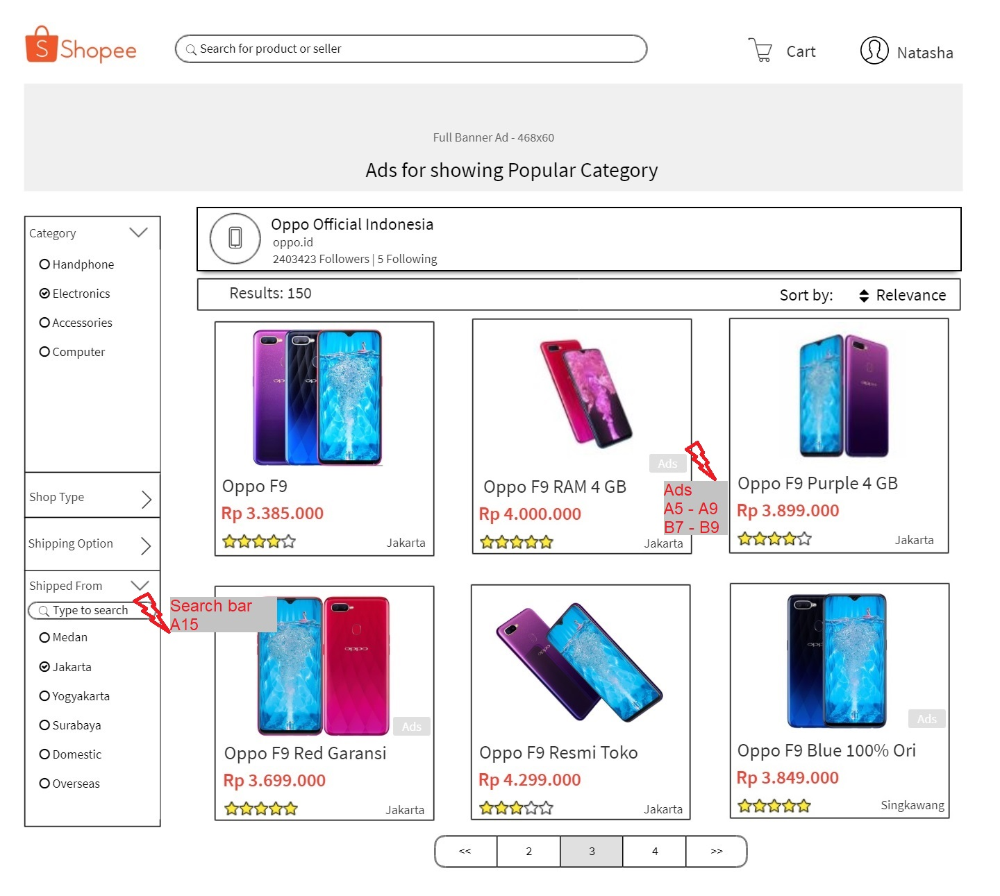

# Usability Evaluation and Prototyping (again)
> Usability Evaluation in this assignment is to evaluate your high-fidelity interactive-prototype with two participants:
> the participant from the previous Contextual Inquiry (CI) 
> and an additional novice-participant with different demographics if possible.
> Respectively, revise your prototype as an attempt to fix any problems found in this Usability Evaluation.

## Operating the Prototype
> Record a video (screen-recording is preferred) while you operating your prototype.
> Present the ideal case on how to interact with the prototype from the beginning to the end.
> Upload the video on any video-sharing website (e.g., YouTube), then attach the video link on this report.

[High Fidelity Youtube](https://youtu.be/eqxtROYaqAM)
---

## Part A: Usability Evaluation
> In this part, you should prepare your high-fidelity interactive-prototype from the assignment 2.
> Invite the participant from your previous CI to test the prototype.
> You also need to invite one more novice participant.
> As with the CI, you might need to videotape your sessions.
> You can benefit from the videotape while writing your `Recording Transcript` later.

### 1. Brief Description of Participants
> Describe your participants in bullets or sentences.
> The description should contain their demographic (age, gender, occupation),
> their skill level in using the system, and your reasons choosing them.
> The description should NOT contain any personally identifiable information.

#### a. Description of Participant 1 🙋
 - Female user of Indonesia origin aged about 40 years old.
 - Her occupation as office worker.
 - She prefers to online shop using mobile application and never open via website browser.
 - She is already familiar with Shopee e-commerce.
 - She usually buy online products once a month, mainly Home and Living category.
 - She is choosen as my participant because she is already familiar with the system and often does shopping in the platform.

#### b. Description of Participant 2 🐼
- Female user of Indonesia origin aged about 17 years old.
- She is a high school student in Surabaya.
- She never do online shop on her own.
- She is already familiar with Shopee e-commerce only in searching products.
- My reasons in choosing her as my participant are difference in age gaps and never do online shopping.

### 2. Evaluation Script

Instruction on buy a product in Shopee:
1. On product listing page, Buy an Oppo F9 RAM 4 GB Variant Red.
Additional questions:
    - Do you agree if official store or partner store is placed at top of the product listing?
    - Do you prefer Ads listed in a row or scattered around?
    - How many items would you prefer to be listed? Infinite scrolling or limited (actual Shopee page is 50 products per page) ?
    - In the 'Shipped From' in sidebar, would you prefer write and search city / province or only select from list?
2. On product detail page, look around the page and after that Buy Now.
    - Are you satisfied with the placing of product images and the thumbnails?
    - Would you rather zoom-in the picture after click first or directly in the picture?
    - On choosing product variant, would you rather choose from a dropdown or a clickable text button?
3. On cart page, review the placing of the items to be bought, apply a voucher code of Gratis Ongkir, and Checkout.
    - Are you satisfied with the placing of product details? Is there any detail missed out?
    - If you want to change variant, would you rather go back to the product detail page or change it directly from variant arrow?
    - For order summary, would you rather place it in the right side of the page or at the bottom of the page?
    - If you want to delete a product from cart list, would you prefer a big cross icon or a small trash icon?
4. On checkout page, review the products, shipping address, and price. Review the voucher code used and choose payment method with credit card.
    - For order summary, would you rather place it in the right side of the page or at the bottom of the page?
    - Are you satisfied with the placing of shipping address?
    - In shipping methods, for products from different store, would you rather to choose it one by one or in one checkout is shipped with the same courier service?

### 3. Transcript
> Provide a summary of what the participant did and said, and what you did and said.
> If at some points you have to help the participants, because they cannot figure out what to do,
> that scene must be included in the transcript.
> It is not necessary to write down every word the participant said,
> just what is interesting and useful.
> Ensure to write down all the actions on the device, whether correct or wrong.
> Remember to supplement the transcript with time-codes or line-numbers.

#### a. Transcript with Participant 1 (17 minutes 58 seconds)

😄 Natasha
🙋 Participant 1

 1. 😄 : "Untuk wawancara pada hari ini, saya akan menunjukkan hasil prototipe dari Shopee yang telah saya buat mengenai alur pembelian sebuah produk. Silahkan di-*review* terlebih dahulu halaman pertama yang berisi daftar produk setelah melakukan pencarian."
 2. 😄: "Satu, menurut partisipan apakah tata letak untuk *official store*, toko yang sesuai dengan pencarian, apakah sudah sesuai? Apakah memuaskan?"
 3. 🙋: "Ditampilkan aja biar bisa jelas. Soalnya kan kalau memilih tokonya ga jelas kan kurang percaya."
 4. 😄: "Kemudian untuk iklan dari produk yang sudah ada, iklannya lebih baik satu baris atau diletakkan secara random? Biasanya iklan akan tertulis 'Iklan' atau 'Ads'."
 5. 🙋: (mencari yang bertanda iklan) "Iklannya dimana? Yang warna abu-abu ini?"
 6. 😄: "Iya, menurut partisipan lebih baik iklannya ditampilkan di atas atau secara random?"
 7. 🙋: "Iklan itu maksudnya gimana ya?"
 8. 😄: " Jadi dari pihak Shopee biasanya akan menjual iklan. Misalkan ada sebuah toko yang menjual produk, bisa saja produknya terletak di halaman ketiga dan tidak sampai dicari oleh pengguna. Jadi pihak Shopee akan menawarkan iklan kepada toko itu untuk menaruh iklan di posisi-posisi tertentu."
 9. 🙋: "Ya pasti tokonya minta ditaruh di atas. Soalnya kan dia bayar buat ditaruh di atas."
 10. 😄: "Jadi lebih baik ditaruh di paling atas?"
 11. 🙋: "Iya."
 12. 😄: "Tetapi biasanya ketika pengguna sudah tahu iklan diletakkan di bagian paling atas, bagian paling atas akan mudah dilewati untuk mencari barang-barang yang lebih relevan di bawah."
 13. 🙋: "Ya tapi dari semua itu, kan pasti lebih banyak yang baca dari atas dulu."
 14. 😄: "Lanjut. Di bagian samping kiri dapat memilih kategori dan dikirim dari mana yang bertuliskan *Shipped From*. Di Shopee yang sebenarnya itu biasanya hanya memilih dari pilihan yang ada kemudian dicentang, kalau di prototipe ini disediakan tempat untuk mengetikkan kata-kata. Apakah lebih baik mengetik sendiri dan menfilter dari list yang ada atau langsung mencentang dari yang sudah ada."
 15. 🙋: "Lebih baik bisa dipilih ya, jadi kan ga banyak ketikan kaya gitu. Jadi kan ga harus mengetik panjang-panjang tinggal mencari pilihannya disini."
 16. 😄: "Baiklah. Selanjutnya, belilah Oppo F9 RAM 4GB warna merah."

 ===== (diarahkan ke halaman detail produk) =====

 17. 😄: "Dari halaman *produk details* ini, apakah setuju dengan penempatan tempat gambar di sebelah kiri dan juga dengan thumbnailnya?"
 18. 🙋: "*Thumbnail* itu yang gambar kecil dibawahnya?"
 19. 😄: "Ya benar, apakah merasa terganggu?"
 20. 🙋: "Iya gapapa, ga masalah."
 21. 😄: "Nah kemudian jika memilih varian, lebih baik variannya dipilih dalam bentuk list tertulis ke bawah seperti varian *red, blue, purple* dengan tulisan kebawah atau langsung diklik dari sebuah tombol. Jadi nanti semua variannya akan tertera kesamping."
 22. 🙋: "Sepertinya lebih baik variannya kesamping. Saya sih lebih senang nge-klik tombol. Jadi ga usah milih kesini, lebih senang milih dalam bentuk gambar."
 23. 😄: "Kemudian Buy Now."

===== (diarahkan ke halaman *Shopping Cart*) =====

24. 😄: "Untuk halaman *shopping cart* ini, apakah setuju dengan peletakkan dari *produk details* yang ada. *Produk details* terdiri dari nama barang, toko, dan harga satuan. Kemudian ke samping tertera varian, kuantitas, dan harga total. Apakah ada masalah? Seperti kurang besar atau bagaimana?"
25. 🙋: "Sepertinya sudah baik, bisa membandingkan antar 2 produk."
26. 🙋: (mengarahkan kursor ke tanda silang merah dan ke tanda minus dibagian kuantitas) "Ini apa bedanya sama ini?"
27. 😄: "Yang tombol minus di kuantitas itu untuk mengurangi kuantitas. Jika awalnya satu, kemudian dikurangi jadi 0 maka barang akan terhapus sama seperti silang."
28. 🙋: "Oh berarti jika isinya 10, langsung disilang aja ga usah minus-minus."
29. 😄: "Jadi jika ingin menghapus sebuah produk, lebih setuju dalam bentuk silang merah besar atau cukup gambar *trash icon* tapi kecil jadi tidak terlihat signifikan."
30. 🙋: "Kalau dikasih kata 'hapus' bagaimana ya? Jadi kan ga bingung. Apa bedanya kalau misalnya saya beli 10, kan langsung centang ini" (mengarahkan ke tanda silang) "tapi kalau beli 1, centang ini kan bisa gitu." (mengarahkan ke tanda minus di Qty).
31. 🙋: "Kalau ini dikasih klik kemudian tulisan yang menunjukkan 'Hapus' bagaimana ya?"
32. 😄: "Jadi diganti kata. Ber arti lebih senang kata-kata daripada gambar?"
33. 🙋: "Iya, karena membingungkan seperti ini."
34. 😄: "Jika ingin mengganti varian lebih baik diganti di cart ini atau kembali ke produk yang ada?"
35. 🙋: "Ya gapapa seperti ini, supaya ga ke halaman depan."
36. 😄: "Untuk lokasi *Order Summary* yang ada di sebelah kanan ini, apakah lebih baik diletakkan di paling bawah *produk details* atau ditaruh di sebelah kanan biar tidak di-*scroll* ke bawah?"
37. 🙋: "Sebentar, kalau misalkan saya membeli 10 item, apakah dia akan mengikuti terus? Misalkan 10 item di-*scroll* kebawah, apakah dia akan mengikuti terus?" (mengarahkan kursor ke bagian *Order Summary*)
38. 😄: "Iya."
39. 🙋: "Iya, gapapa seperti ini aja. Soalnya kalau ditampilkan di bawah, saya harus *scroll* ke bawah dulu baru melihat ke bawah. Saya lebih setuju di kanan sih."
40. 😄: "Lalu aplikasikan kode voucher gratis ongkir."
41. 🙋: (mengarahkan ke tombol Apply di sebelah Voucher Code)
42. 😄: "Apakah setuju jika ada daftar dari kode voucher yang sudah dimiliki kemudian ada juga pilihan untuk mengisi voucher code seperti di atas?"
43. 🙋: "Saya tidak setuju soalnya orang ga gampang mengingat kata-katanya. Misalkan ada promo, kan harus nginget dan harus ngetik apa. Kalau ngetik salah sedikit saja, ga keluar vouchernya."
44. 😄: "Kemudian klik OK, dan Checkout produk."

===== (diarahkan ke halaman Checkout) =====

45. 😄: "Untuk bagian terakhir, apakah tetap setuju jika *Order Summary* diletakkan di sebelah kanan? Yang di Shopee terletak di bawah seperti ini, menggantung jika di-*scroll* akan menutup bagian bawah dan akan menempel jika sudah sesuai tempatnya dibagian bawah produk."
46. 🙋: "Ya enak sebelah kanan ya, lebih gampang melihatnya. Kalau di-*scroll*, dia akan ikut terus kan?"
47. 😄: "Ya akan tetap ikut."
48. 😄: "Untuk pemilihan alamat pengiriman yang ada di bagian atas ini, lebih baik dibuat pilihan atau cukup mengganti sesuai yang dipilih. Misalkan saya memiliki 3 alamat yang bisa dituju, apakah lebih baik mencentang salah satu atau hanya menampilkan satu yang dituju?"
49. 🙋: (mengarahkan ke tombol Change di sebelah alamat tertera) "Ga papa, tampilin aja salah satu. Kan ada 'Change' disini untuk mengganti alamatnya."
50. 😄: "Untuk produk detail kan saya memiliki metode pengiriman. Apakah lebih setuju untuk produk-produk dari toko yang berbeda dapat memilih kurir yang berbeda atau untuk setiap order langsung memilih satu kurir yang sama meskipun berbeda toko."
51. 🙋: "Ya saya ga masalah yang manapun karena dari Shopee sudah ada Free Ongkir jadi memilih yang paling murah. Saya baru *notice* jika ada selisih harga yang besar. Promonya kan harusnya gratis tapi kenapa keluar gede banget. Baru saya lihat lagi."
52. 😄: "Maksud saya adalah menggabungkan produk yang dibeli dari toko berbeda dengan jenis pengiriman yang sama."
53. 🙋: "Oh ya jangan, kalau misalkan saya membeli toko Surabaya dan membeli barang makanan dan bisa dikirim GO-SEND ya saya pasti memilih yang GO-SEND agar makanannya tidak busuk. Jadi ya lebih mending satu-satu."
54. 😄: "Baiklah kalau begitu."
55. 😄: "Kemudian memilih cara pembayaran."
56. 🙋: (memilih Pay Now) "Iya, lalu?"
57. 😄: "Apakah ada masalah jika menuliskan kartunya disini dan waktu expirednya kemudian menggantinya? Apakah lebih baik diisi melalui profil pengguna saja?"
58. 🙋: "Engga, ga masalah."
59. 😄: "Terakhir, klik Place Order."
60. 😄: "Terima kasih karena telah bersedia mencari partisipan dalam wawancara saya mengenai prototipe dari halaman Shopee."

#### b. Transcript with Participant 2 (9 minutes 37 seconds)

😄 Natasha
🐼 Participant 2

 1. 😄: "Berikut adalah prototipe dari halaman web Shopee Indonesia. Pada kali ini, kita mengikuti alur bagaimana cara membeli sebuah produk. Pertama, saya akan menunjukkan halaman untuk menampilkan daftar produk setelah melakukan pencarian. Silahkan di *explore*. "
 2. 😄: "Pertanyaan pertama, apakah anda setuju jika *official store* yang sesuai dengan produk yang dicari diletakkan di bagian paling atas sendiri? Tulisannya Oppo Official Indonesia?"
 3. 🐼: "Setuju."
 4. : "Mengapa setuju?"
 5. 🐼: "Supaya terlihat jelas dan mendapat rekomendasi bahwa tersedia toko yang sudah *official*."
 6. 😄: "Kedua, apakah anda lebih setuju jika iklan ditampilkan di bagian paling atas sendiri atau diletakkan secara *random*?"
 7. 🐼: (scroll mencari bagian mana yang termasuk iklan) "Iklan itu yang mana?"
 8. 😄: "Nah, iklan itu yang warnanya abu-abu tulisannya Ads. Untuk iklan apakah anda lebih setuju diletakkan paling atas sendiri atau tersebar?"
 9. 🐼: "Lebih baik diletakkan di paling atas saja supaya tidak mengganggu saat *searching* produk."
 10. 😄: "Untuk banyak item ini, apakah anda lebih setuju untuk men-*scroll* terus *infinite scrolling* ataupun dibatasi misalnya hanya 50 produk untuk 1 page, kemudian memilih produk selanjutnya dengan masuk ke halaman ke-4? Seperti di handphone kan *infinite scrolling*."
 11. 🐼: "Hmm.. Lebih baik kalau dibatasi dengan *page* saja supaya kalau misalnya suka dengan barang A di *page* B kan lebih gampang mencari."
 12. 😄: "Selanjutnya, di bagian *side bar* tertulis kategori, tipe toko, pemilihan pengiriman, dan terakhir dikirim dari. Jika anda ingin memilih toko yang berada di Jakarta, apakah anda lebih menyukai untuk mencentang langsung atau lebih suka untuk mengetik?"
 13. 🐼: "Mengetik karena lebih cepat."
 14. 😄: "Kemudian silahkan dilanjutkan dengan membeli produk OPPO F9 RAM 4GB warna merah."

===== (pindah ke halaman detail produk) =====

 16. 😄: "Ini dari halaman detail produk Oppo F9, apakah anda merasa terganggu dengan gambar yang tertera di sebelah kiri?"
 17. 🐼: "Tidak, mengapa harus terganggu?"
 18. 😄: "Thumbnailnya apakah kurang kecil? Thumbnail adalah gambar-gambar kecil untuk menunjukkan gambar selanjutnya."
 19. 🐼: "Oh ya, sudah bagus supaya kelihatan apa gambar selanjutnya."
 20. 😄: "Untuk zoom-in gambar apakah anda lebih setuju jika terjadi setelah di-klik gambarnya baru dapat di zoom-in? Atau langsung dapat di zoom-in pada gambar yang tertera?"
 21. 🐼: "Lebih baik dapat di-zoom in langsung di gambar yang tertera sehingga tidak perlu mengeklik apa-apa."
 22. 😄: "Jika ingin memilih varian yang tersedia, misalnya ada merah dan ungu. Jika mengeklik akan muncul dropdown tulisan ke bawah berisi merah dan ungu. Anda lebih suka dimunculkan dalam bentuk list ke bawah atau tombol ke samping?"
 23. 🐼: "Lebih bagus menyamping."
 24. 😄: "Bentuk tombol?"
 25. 🐼: "Ya. Karena lebih mudah untuk dilihat jika langsung dituliskan ke samping."
 26. 😄: "Lalu, pilih Beli Sekarang atau Buy Now." 

 ===== (mengarahkan ke halaman shopping cart) =====

 27. 😄: "Ini adalah halaman untuk *shopping cart*. Apakah anda setuju dengan peletakkan *product details* yang menyatakan produk, toko, dan harga per satuannya?"
 28. 🐼: "Ya setuju."
 29. 😄: "Jika ingin mengganti produk varian, apakah anda lebih memilih menggantinya secara langsung di shopping cart atau kembali lagi ke halaman produknya?"
 30. 😄: "Varian itu kan ada tombol *arrow* bisa langsung diganti di situ atau harus kembali ke produknya dulu?"
 31. 🐼: "Ya, langsung diganti di shopping cart aja."
 32. 😄: "Untuk *Order Summary*, apakah anda lebih setuju jika terletak di sebelah kanan atau lebih setuju jika diletakkan di bagian paling bawah dari produk?"
 33. 🐼: "Di samping."
 34. 😄: "Karena?"
 35. 🐼: "Apa ya, lebih mudah untuk melihatnya seberapa banyak item yang telah dipilih dan harga dari total produknya sehingga tidak perlu *scroll* sampai ke bawah dahulu baru kelihatan."
 36. 😄: "Jika anda ingin menghapus sebuah produk, apakah anda lebih menyukai tanda silang merah besar atau dalam bentuk ikon gambar tong sampah yang kecil?"
 37. 🐼: "Sebenarnya sama saja."
 38. 😄: "Mungkin ada preferensi lebih condong kemana?"
 39. 🐼: "Lebih suka tanda silang yang besar supaya mudah di-*notice*. "
 40. 😄: "Kemudian aplikasikan kode voucher gratis ongkir."
 41. 🐼: (Mengeklik tulisan Voucher code tetapi tidak terjadi apa-apa kemudian mengeklik tombol Apply baru kemudian muncul halaman Voucher Code)
 42. 😄: "Untuk bagian voucher code ini, apakah anda lebih suka mengeklik pilihan atau mengetik kode voucher nya?"
 43. 🐼: "Lebih suka mengeklik pilihan karena lebih mudah. Saya tidak perlu mengingat kode voucher dari promo dan menulisnya lagi. Biasanya jika saya salah tulis harus keluar kembali, harus mencari halaman promo, baru menghafalkan atau kadang men-*copy* dari kode promo yang ada."
 44. 😄: "Kemudian klik Checkout."
 
 ===== (pindah ke halaman Checkout) =====

 45. 😄: "Ini adalah halaman *checkout* setelah dari halaman *shopping cart*. Halaman ini digunakan untuk memastikan kembali produk yang dibeli, alamat pengiriman, dan jasa kurir yang dipilih."
 46. 😄: "Untuk *shipping address*, anda lebih memilih ditampilkan satu saja ataupun dibentuk dalam list-list dari alamat yang sudah disimpan. Misalnya ada 3 alamat, kemudian anda mencentang salah satu. Ditampilkan ketiganya atau hanya ditampilkan salah satu saja yang mau dikirim kemana?"
 47. 🐼: "Ditampilkan salah satu saja supaya tidak membingungkan jika saya memiliki alamat banyak."
 48. 😄: "Untuk *Order Summary*, apakah anda tetap setuju jika diletakkan disebelah kanan?"
 49. 🐼: "Iya setuju, lebih jelas."
 50. 😄: "Kemudian untuk metode pengiriman, apakah anda setuju jika tersedia opsi pengiriman yang berbeda dari toko berbeda atau dijadikan satu saja meskipun dari toko yang berbeda?"
 51. 🐼: "Lebih baik dijadikan satu saja, tidak repot."
 52. 😄: "Kemudian, pilih *payment method*. Apakah anda mendapati kebingungan untuk memilih metode pembayaran?"
 53. 🐼: "Tidak, sepertinya bisa langsung dimasukkan ke halaman tersebut."
 54. 😄: "Baiklah, terakhir pilih Place Order."
 55. 😄: "Terima kasih karena telah bersedia mencari partisipan dalam wawancara saya mengenai prototipe dari halaman Shopee."
 56. 🐼: "Ya, sama-sama tidak masalah."

### 4. Feedback and Incidence Analysis
> Record your observations per prototype screen followed by reference, feedback, incidence, reason, and resolution.

Code format for line-number: X - YY where 
- X is the Participant, A is for Participant 1 and B is for Participant 2
- YY is the line numbers from transcript

#### OBSERVATION 1

 - **Reference**: Ads (A5 - A9 & B7 - B9) and Search Bar (A15)
 - **Feedback**: For ads, it is not clearly shown to the participants view. While for search bar, participant 1 prefer to only click rather than to type again.
 - **Incidence**: -
 - **Reason**: -
 - **Resolution**: Ads should be put at the first row of the page and search bar should be available for type, filter and checklist.
 
#### OBSERVATION 2

 - **Reference**: Variant (A22 & B22 - B25)
 - **Feedback**: They prefer to directly click on button list rather than a dropdown list.
 - **Incidence**: Click on variant dropdown.
 - **Reason**: Need to click twice for dropdown to open, read the list, and choose the variant.
 - **Resolution**: Change dropdown in variant to a button list of available variants.
 
#### OBSERVATION 3

 - **Reference**:  Cross icon to delete (A26 - A33)
 - **Feedback**: It confused the participant what is the difference between cross icon and minus icon in quantity. 
 - **Incidence**: Click on minus icon repeatedly to remove many items.
 - **Reason**: The participant does not know the difference between cross icon and minus icon while they share the same functionality (only differ in quantity change). The participant also does not know what is the meaning of the icon.
 - **Resolution**: Change big red cross icon to a small trash icon with description text of 'Hapus'
 
 #### OBSERVATION 4

 - **Reference**:  Voucher Code (A43 & B43)
 - **Feedback**: It is not necessary to enter voucher code because it is hard to remember the phrase (code).
 - **Incidence**: Mistype the voucher code and the voucher not showing. Have to go back to promo page.
 - **Reason**: It is hard to remember the voucher code presented in other page (promo page). Participant have to go back and forth if there is a mistype in the code.
 - **Resolution**: Remove entirely 'Enter voucher code' section.
 
 #### OBSERVATION 5

 - **Reference**:  Cross icon to delete (A33) and Shipping Method (B51)
 - **Feedback**: It confuses participant what is the meaning of cross icon. Shipping method should be grouped per one order only one courier to make it easy.
 - **Incidence**: -
 - **Reason**: -
 - **Resolution**: Change big red cross icon to a small trash icon with description text of 'Hapus'. While the shipping method will not be changed because it requires to differentiate based on urgency of the products (ex: food)
 
 
 ---

## Part B: Prototyping (again)
> Next, you will need to modify your prototype 
> based on the resolutions you have suggested in `Feedback and Incidence Analysis`'s observations.

### Sketch

### Design Rationale
> Please write a paragraph expressing what you have learned from the usability evaluation, 
> and how it is reflected in your design.

From usability evaluation on two participants, every comment that they gives are valuable, however, not all opinion and suggestion can be implemented in the design. For example is the shipping method, while the first participant want it to be separated, the other want to be joined. In the end, I should choose a resolution which is more rational.
Nevertheless, both of their opinions which is not contradictory can be combined to make a better intuitive design. For example in side bar of Shipped from, the first opinion to select from a list can be combined with a filtered search from input text within the second opinion.

### High-Fidelity Interactive-Prototype
> Create a high-fidelity interactive-prototype based on the `Sketch` you have drawn.
> You can use any prototyping tools: InVision, Adobe XD, or even Microsoft PowerPoint.

[High Fidelity Prototype Version 2](https://invis.io/NGR8KOQUQA7#/361033052_6productlist_V2)
 
[High Fidelity Youtube Link](https://youtu.be/Hsxvau8Wpp4)